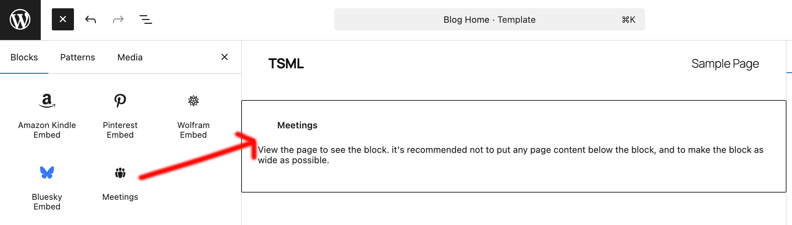
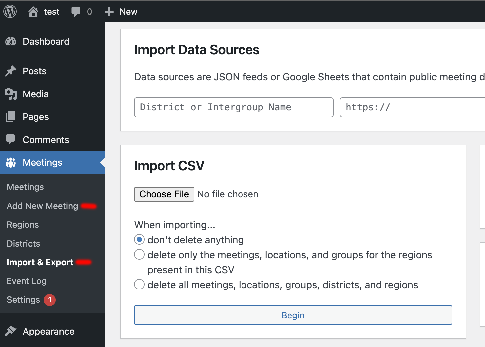
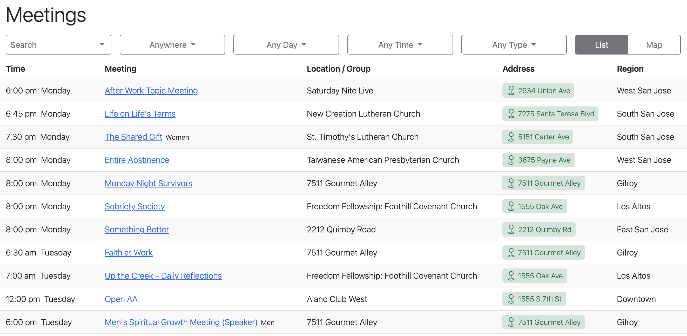

# Development Setup

Thanks for helping improve **12-Step Meeting List (TSML)**!  
This guide explains how to set up a local WordPress environment for development and testing.

---

## Local Development Options

1. [**wp-env (Quick Start)**](#wp-env-quick-start) — zero-config setup maintained by WordPress core.  
2. [**Docker Compose (Advanced)**](#docker-compose-advanced) — more flexible if you want custom containers or debugging tools.  
3. [**Manual Installation**](#manual-installation) — for developers who prefer to install WordPress manually.

---

### wp-env (Quick Start)

[`@wordpress/env`](https://developer.wordpress.org/block-editor/reference-guides/packages/packages-env/) provides a Docker-based environment that works out of the box.

**Requires:** [Docker Desktop](https://www.docker.com/get-started/)

Run the following commands from the project root:

```bash
npm install -g @wordpress/env
npm install
wp-env start
```

Then open:

- http://localhost:8888 — complete WordPress installation.
- http://localhost:8888/wp-admin/plugins.php — activate the **12-Step Meeting List** plugin.

**Notes**

- Run `wp-env stop` to shut down the environment.
- Run `wp-env destroy` to delete all containers and volumes.

---

### Docker Compose (Advanced)

[Docker Compose](https://docs.docker.com/compose/) gives full control over your stack (versions, volumes, Xdebug, etc.).

**Requires:** [Docker Desktop](https://www.docker.com/get-started/)

Create the following two files in the project root:

<details>
<summary><strong>Dockerfile</strong></summary>

```Dockerfile
    FROM wordpress:6.8.3-php8.3-apache
    RUN apt-get update && \
        apt-get install -y  --no-install-recommends ssl-cert && \
        rm -r /var/lib/apt/lists/* && \
        a2enmod ssl rewrite expires && \
        a2ensite default-ssl
    ENV PHP_INI_PATH "/usr/local/etc/php/php.ini"
    RUN pecl install xdebug-3.4.2 && docker-php-ext-enable xdebug \
        && echo "xdebug.mode=debug" >> ${PHP_INI_PATH} \
        && echo "xdebug.client_port=9003" >> ${PHP_INI_PATH} \
        && echo "xdebug.client_host=host.docker.internal" >> ${PHP_INI_PATH} \
        && echo "xdebug.start_with_request=yes" >> ${PHP_INI_PATH} \
        && echo "xdebug.log=/tmp/xdebug.log" >> ${PHP_INI_PATH} \
        && echo "xdebug.idekey=IDE_DEBUG" >> ${PHP_INI_PATH}
    EXPOSE 80
    EXPOSE 443
```

</details>

<details>
<summary><strong>docker-compose.yml</strong></summary>

```yaml
services:
  wordpress:
    depends_on:
      - db
    build: .
    restart: always
    ports:
      - 8888:80
      - 7443:443
    environment:
      WORDPRESS_DEBUG: "true"
      WORDPRESS_DB_HOST: db:3306
      WORDPRESS_DB_USER: wordpress
      WORDPRESS_DB_PASSWORD: wordpress
      WORDPRESS_DB_NAME: wordpress
    volumes:
      - ../:/var/www/html/wp-content/plugins
      - ./logs/:/var/log/apache2

  db:
    image: mariadb:10.11
    restart: always
    ports:
      - 3306:3306
    environment:
      MARIADB_ROOT_PASSWORD: somewordpress
      MARIADB_DATABASE: wordpress
      MARIADB_USER: wordpress
      MARIADB_PASSWORD: wordpress
```

</details>

**Run it**

```bash
docker compose up
```

Then open:

- http://localhost:8888 — complete WordPress installation.
- http://localhost:8888/wp-admin/plugins.php — activate the **12-Step Meeting List** plugin.

**Useful commands**

```bash
docker compose down          # stop containers
docker compose down -v       # remove all volumes
docker compose logs -f       # view logs
```

---

### Manual Installation

Follow [WordPress’s official manual installation guide](https://developer.wordpress.org/advanced-administration/before-install/howto-install/) if you prefer to set up your own environment.

---

## Plugin Configuration

Once WordPress and TSML are running:

1. Log into **wp-admin** (`http://localhost:8888/wp-admin/`).
2. Add the **Meetings** block to any template/page/post using the visual editor, or insert the `[tsml_ui]` shortcode in code view.  
   *(Recommended: keep the page content empty below the block and make it as wide as possible)*

   

3. Import or create meetings:  
   Go to **Meetings → Import & Export** and use [this template CSV](https://github.com/code4recovery/12-step-meeting-list/blob/main/template.csv).  
   You can also click **Meetings → Add Meeting** to add entries manually.

   

4. View your meetings page — you should see the meeting list rendered.  

   

---

## Releasing

Releases are cut by pushing a version tag. The `release` GitHub Action then builds the
plugin zip, creates a GitHub release, and deploys to WordPress.org.

1. Bump the version in **three** places, which must match exactly:
   - `TSML_VERSION` in `12-step-meeting-list.php`
   - `Version:` header in `12-step-meeting-list.php`
   - `Stable tag:` in `readme.txt`
2. Add a `= x.y.z =` changelog block for the new version to `readme.txt`.
3. Rebuild committed assets if JS/SCSS changed: `npm run build`, then commit.
4. Merge to `main`, then tag and push:

   ```bash
   git tag v3.19.18      # tag matches the version, with a "v" prefix
   git push origin v3.19.18
   ```

The workflow aborts if the tag, the two plugin versions, and the readme stable tag
don't all agree. WordPress.org deploy requires the `WORDPRESS_USERNAME` and
`WORDPRESS_PASSWORD` repo secrets; without them it skips and only the GitHub release
is made. Tags containing `beta` publish a GitHub prerelease and skip WordPress.org.

To build the zip locally without releasing: `make build` (output in `build/`).

---

### 👍 Thanks for contributing!

Your help keeps TSML improving for groups and meetings everywhere.
